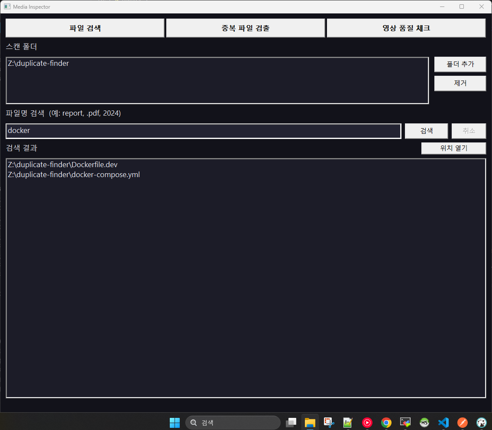
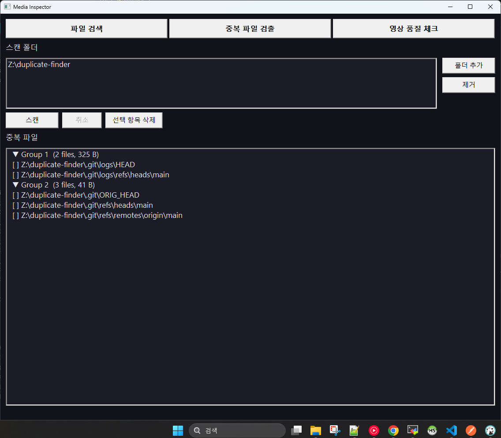
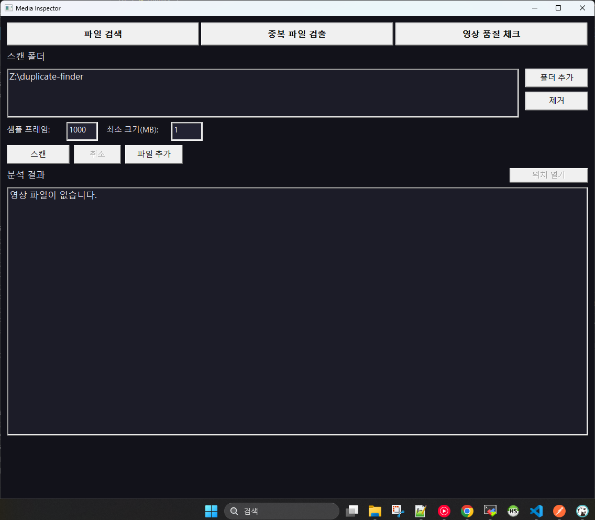

# Media Inspector

A Windows media file management tool with file search, duplicate detection, and video quality analysis — all in one window.

Built with pure Rust + Win32 API — no runtime dependencies, single executable.  
Requires **ffprobe** (included with FFmpeg) for video quality analysis.

## Download

| File | Description | Platform |
|------|-------------|----------|
| [MediaInspector.zip](https://github.com/qmdch1/media-inspector/releases/latest/download/MediaInspector.zip) | MediaInspector + ffprobe (all-in-one) | Windows (x64) |
| [MediaInspector.exe](https://github.com/qmdch1/media-inspector/releases/latest/download/MediaInspector.exe) | Standalone exe (ffprobe required separately) | Windows (x64) |
| [ffprobe.exe](https://github.com/qmdch1/media-inspector/releases/latest/download/ffprobe.exe) | ffprobe only | Windows (x64) |

---

## Screenshots

### File Search


### Duplicate Finder


### Video Quality Check


---

## Features

- Three tools in one window: **File Search**, **Duplicate Finder**, **Video Quality Check**
- All tabs share the same folder list — add folders once, use everywhere
- Cancel any running scan at any time
- Dark theme UI (Segoe UI)

### File Search
- Recursively search filenames by keyword across multiple folders
- Press **Enter** or click **Search** to run
- Select a result and click **Open Location** to reveal it in Explorer

### Duplicate Finder
- Recursively scans folders and groups identical files by partial MD5 hash
- Select duplicates and delete them in bulk
- Shows total wasted space

### Video Quality Check
- ffprobe-based frame analysis covering 15 issue types
- Three-tier classification based on severity score: **Problem / Warning / OK**
- Click a result to view detailed issues in the panel below
- Open file location in Explorer
- Configurable sample frame count and minimum file size

---

## Detected Issues

| Code | Description | Score |
|------|-------------|:-----:|
| `VFR` | Variable frame rate — possible stuttering | 25 |
| `DROP` | Frame drops detected | 25 |
| `CORRUPT` | Corrupted/missing frames | 25 |
| `COMPAT` | Codec/profile compatibility risk | 20 |
| `AVSYNC` | Audio/video sync error | 20 |
| `BSPK` | Bitrate spike | 15 |
| `GOP` | Keyframe interval too long (>10s) | 15 |
| `LOWBR` | Low bitrate relative to resolution | 15 |
| `CTRMM` | Container/codec mismatch | 15 |
| `NOAUD` | No audio stream | 10 |
| `GOPI` | Irregular keyframe intervals | 10 |
| `DUR` | Abnormal duration | 10 |
| `HIBR` | Abnormally high bitrate | 5 |
| `RES` | Non-standard resolution | 5 |
| `ROT` | Rotation metadata (portrait video) | 5 |

**Score thresholds**

| Score | Classification |
|:-----:|----------------|
| 0 | ✔ OK |
| 1 – 29 | ⚠ Warning |
| 30+ | ✖ Problem |

---

## Requirements

| Item | Details |
|------|---------|
| OS | Windows 10 x64 or later |
| Runtime | None (statically linked) |
| Dependency | [ffprobe](https://ffmpeg.org/download.html) — required for Video Quality Check only |

> ffprobe is included in the FFmpeg package.  
> If ffprobe is not found on startup, a warning is shown. File Search and Duplicate Finder work without it.

---

## FFmpeg Installation

### Option 1 — winget (recommended)

```powershell
winget install --id Gyan.FFmpeg -e
```

### Option 2 — Manual

1. Download from [https://ffmpeg.org/download.html](https://ffmpeg.org/download.html)
2. Extract and locate `ffprobe.exe` inside the `bin\` folder
3. Add `bin\` to your system **PATH**, or place `ffprobe.exe` next to `MediaInspector.exe`

---

## Build

```powershell
# Install Rust: https://rustup.rs
.\build.ps1
# Output: dist\MediaInspector.exe
```

```powershell
cargo build --release
# Output: target\release\MediaInspector.exe
```

---

## Options

| Option | Default | Description |
|--------|:-------:|-------------|
| Sample frames | 1000 | Number of leading frames to sample for video analysis (50–5000) |
| Min size (MB) | 1 | Skip video files smaller than this size |

---

## Tech Stack

| | |
|---|---|
| Language | Rust (edition 2021) |
| GUI | Win32 API (`windows` crate 0.61) |
| Analysis | ffprobe (JSON output) + pure Rust logic |
| JSON parsing | `serde_json` |
| Build | Cargo + `winresource` (icon embed) |
| Release | `opt-level = "z"`, LTO, strip |

---

## License

[MIT](LICENSE)
